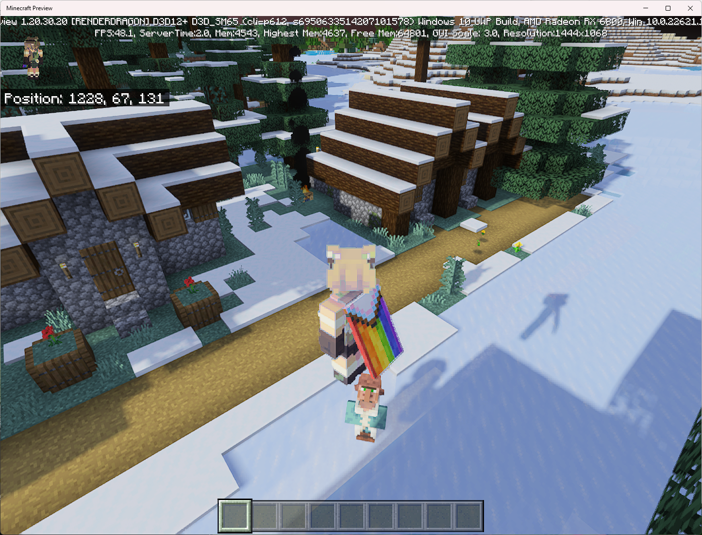
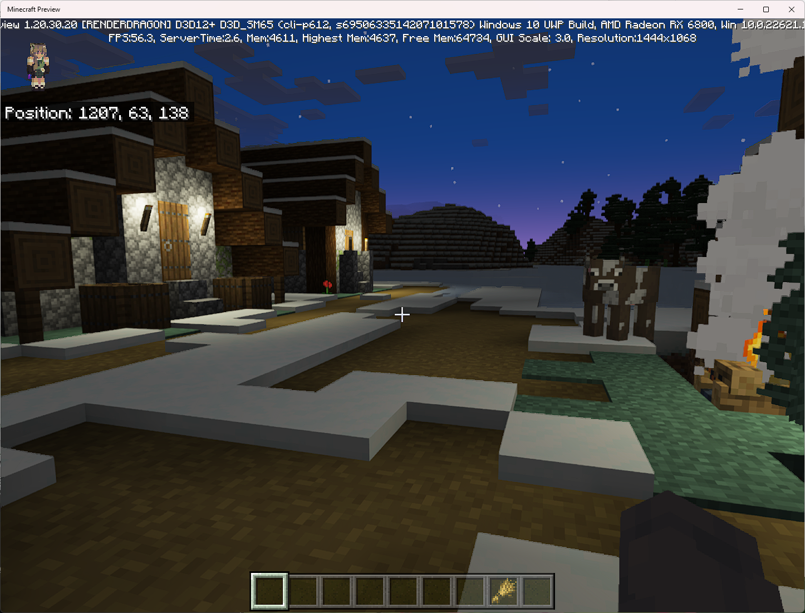
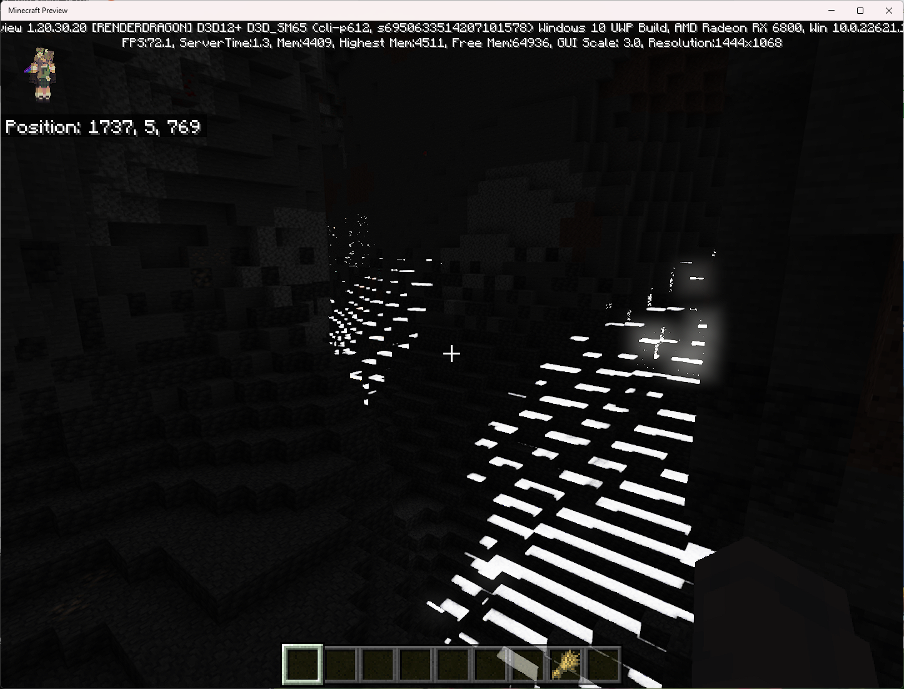

# BedrockRenderDragonActivate
Activate Minecraft Bedrocks Deferred Technical Preview Shader

This shader pack is the most basic one that can activate Minecraft's Render Dragon graphics engine. Minecraft are calling this preview lighting pipeline the 'Deferred Technical Preview'. Here is [Minecraft's news release](https://www.minecraft.net/en-us/creator/article/new-render-dragon-features-creators) with more information. This shader pack does not contain any textures and only activates the Render Dragon lighting preview and simulates Sun and Moon lighting changes, provides shadows, and blooming effects. Since there are no PBR textures in this shader pack, effects like reflection or emission from blocks are not present. I definitely recommend this shader pack if you want to see how your hardware performs with the lighting shadows of this new rendering pipeline. Any other shader pack you use will have more features like PBR textures that may cause more lag. The Sun and Moon lighting effects for this most basic shader are taken directly from [Minecraft's Deferred Lighting Beginner Tutorial](https://learn.microsoft.com/en-us/minecraft/creator/documents/deferredlighting)

## Installation:
- Make sure you are on a beta/preview version of Bedrock Minecraft V1.20.30.20 or higher for Windows, Android, or Xbox. [Instructions](https://www.minecraft.net/en-us/article/how-get-minecraft-betas) for joining the beta for each device is provided.

- Download the [shader mcpack file](https://raw.githubusercontent.com/christopherburke/BedrockRenderDragonActivate/master/BedrockRenderDragonActivate.mcpack) from this github repository. This shader only contains json files and no texture images. The json files are provided on this github repository for you to examine.

- Install the shader pack
  - Windows - Find BedrockRenderDragonActivate.mcpack file. Right click on file, and select Minecraft Preview to open.
  - Android - I have found that the 'FV File Manager' file browser app on Google Play store allows one to open the mcpack file with Minecraft. The default file browser on my Samsung Table S8 was unable to open the mcpack file with Minecraft.

- In Minecraft Preview version 'Create New World'

- From the create new world menus, select the Experiments menu, then turn on 'Render Dragon Features for Creators'

- From the create new world menus, select the Resource Packs, then activate the BedrockRenderDragonActivate shader.

- Create/Start the world

- After the game starts, go to the settings menu.

- In the settings menu, select Vido, then scroll all the way to the bottom where under 'Graphics Mode' select the 'Deferred Technical Preview' option.

- Go back to the game and enjoy your newly activated Shader with shadows, sky color changes, etc..

## Many Artifacts
Despite this being the most basic Render Dragon pipeline shader pack possible, there are still lots of artifacts. Especially underwater and in caves during the day as light will leak into cave and look corrupted. Also, sometimes there can be pauses and crashes.

## Next Steps
If you want to try awesome shader packs that include all the PBR textures that allow blocks with reflections, emission, and smoothness characteristics then I recommend googling how to download the following.
- The base 'Vanilla-RTX-v2.5.1.mcpack' as well as 'Vanilla-RTX-textured-water-addon-v2.5.mcpack' and 'Vanilla-RTX-3d-stone-addon-v2.5.mcpack'
- Poggy's Beta Shader
